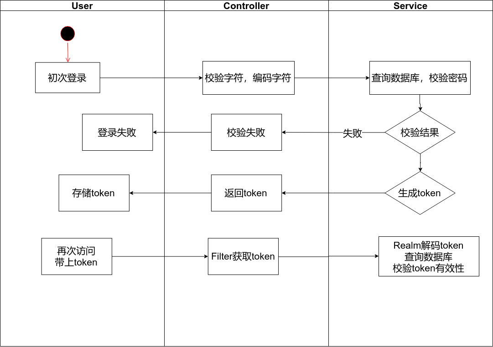

# SpringBoot_Shiro_Demo
详细运行可以参考doc/Postman调试.doc 
原文：https://www.jianshu.com/p/f37f8c295057 
源代码的github:https://github.com/Smith-Cruise/Spring-Boot-Shiro

## log
* 增加shiro的访问流程图

* 找到了后端过滤器中的获取Authorization字段的依据。